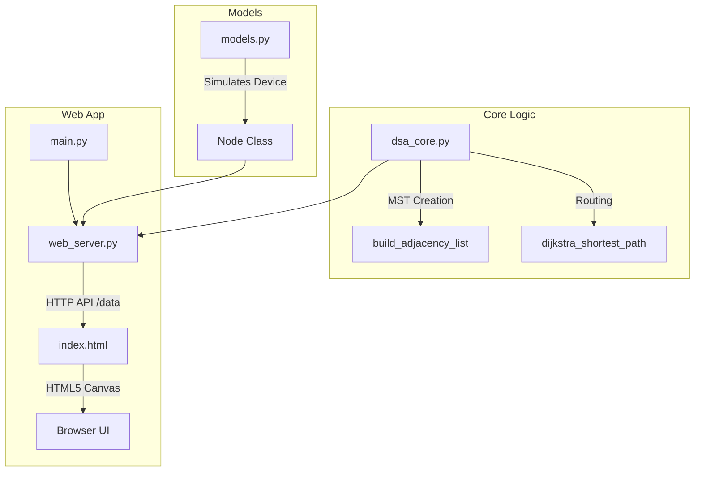

# Disaster-Time Communication System - Implementation Details

This document explains the internal architecture, core algorithms, data structures, and how the different components of the system interact.

---

## 1. System Architecture Overview

The system simulates a mobile ad-hoc network (MANET) where communication nodes (devices) move around randomly, consume battery, and occasionally fail. The goal is to maintain a power-efficient communication backbone and route messages from a starting node to a destination server.



---

## 2. Core Data Structures & Algorithms (`dsa_core.py`)

This file contains the fundamental Data Structures and Algorithms (DSA) that power the network topology and routing.

### A. Graph Representation
The network is represented as an **Adjacency List** using nested Python dictionaries:
```python
graph = {
    node_id_1: { neighbor_id_a: weight_1a, neighbor_id_b: weight_1b },
    node_id_2: { ... }
}
```
This is memory-efficient and allows $O(1)$ lookups for neighbor weights.

### B. Kruskal's Algorithm & Minimum Spanning Tree (MST)
To prevent redundant communication loops and preserve energy, the system builds an MST connection backbone. 
- **Weight Function**: The edge weight between two nodes is not just physical distance; it also penalizes low battery levels:
  $$\text{Weight} = \text{Euclidean Distance} + (100 - \text{Battery}_A) + (100 - \text{Battery}_B)$$
  This naturally shifts routing *away* from dying nodes.
- **Union-Find (Disjoint Set Union)**: A helper class `UnionFind` implements path compression to check in $O(\alpha(V))$ time whether adding an edge creates a cycle.
- **Kruskal's Loop**:
  1. Sort all potential edges (within transmission range) by weight.
  2. Iterate through edges, using Union-Find to add them if they connect disjoint network segments.
  3. Generate the MST adjacency list.

### C. Dijkstra's Algorithm & Custom Priority Queue
Once the MST backbone is built, the system calculates the optimal path from the selected starting node to the destination server using Dijkstra's algorithm.
- **Priority Queue**: Implemented via a wrapper around Python's `heapq` module. Items are stored as `(priority, item)` tuples, guaranteeing $O(\log V)$ insertions and extraction of the minimum cost node.
- **Execution Flow**:
  1. Initialize `cost_so_far` dictionary with $\infty$ for all nodes, except the start node which is $0$.
  2. Push the start node to the `PriorityQueue`.
  3. While queue is not empty, pop the node with the lowest cost.
  4. If the destination node is reached, exit early.
  5. Relax neighbors: if routing through the current node yields a lower cost than previously recorded, update `cost_so_far`, set `came_from[neighbor] = current`, and push the neighbor to the queue.
  6. Reconstruct the path backwards from the destination to the start node.

---

## 3. Simulation Models (`models.py`)

The `Node` class represents a mobile communication device.

- **Movement Vector**: Each node has coordinate values `(x, y)` and velocity values `(dx, dy)`. At each update step, coordinates are incremented. If a node hits the canvas boundaries, its velocity is inverted (`dx *= -1` or `dy *= -1`) to bounce it back.
- **Battery Drain**: Every time a node moves, its battery drains by a random value ($0.005$ to $0.02$). If the battery drops to $0\%$, the node is flagged as `failed = True` and stops moving/transmitting.
- **Special Roles**:
  - `is_static`: If `True`, the node does not move.
  - `is_immortal`: If `True`, the node's battery does not drain.
  - The destination base station (Goal Node) is configured with both roles.

---

## 4. Web Visualizer (`web_server.py` + `index.html`)

This setup uses a Python HTTP server as a backend and an HTML5 Canvas frontend.

- **Multi-threaded Backend**:
  - The main thread runs the `socketserver.TCPServer` to handle HTTP requests.
  - A daemon background thread runs `GlobalState.update()` at $10\text{ FPS}$ to update node positions and drain battery levels.
  - Thread-safe state modifications are guaranteed using `threading.Lock()`.
- **API Endpoints**:
  - `/`: Serves `index.html`.
  - `/data`: Returns the current network state (`nodes`, `edges` in MST, Dijkstra `path`, `cost`, `source_id`, `goal_id`) in JSON format.
  - `/set_source?id=<node>`: Sets `user_source_id` in the backend state.
  - `/fail`: Induces a random node failure.
  - `/reset`: Re-initializes all nodes.
- **Frontend Canvas Rendering**:
  - Draws potential edges (dashed lines) and the active path (solid glowing blue line).
  - Uses `requestAnimationFrame` for smooth rendering.
  - Added a `mousemove` handler to detect hover over nodes and change cursor to `pointer`.
  - Added a `click` handler that computes canvas coordinates and triggers a fetch request to `/set_source?id=<node_id>` to update the starting node.
